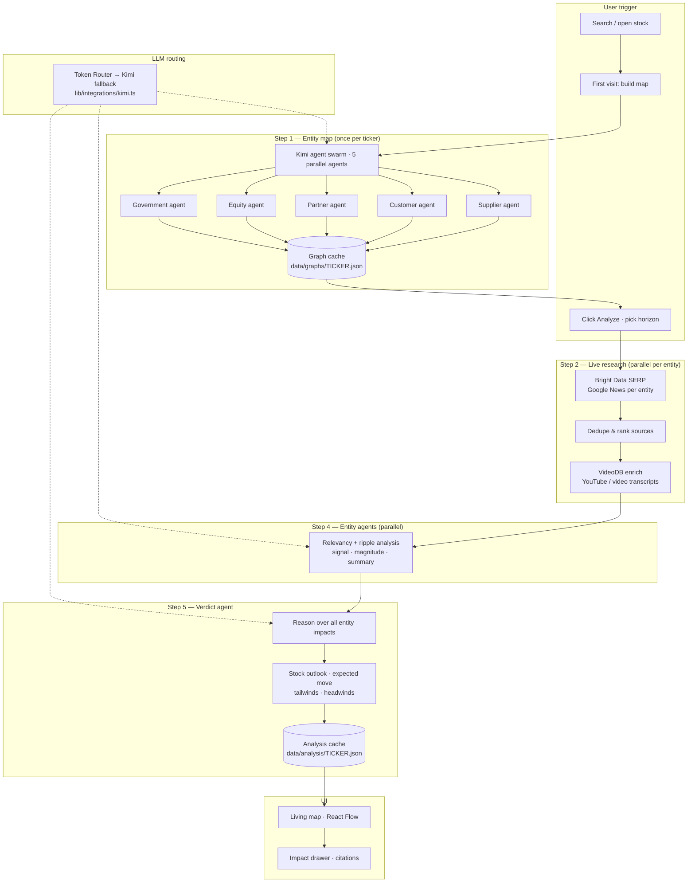

# FinnSmart Agentic Pipeline

Behind the scenes, FinnSmart runs a full agentic pipeline. Each fundamental task is handled by a dedicated agent step. Token Router routes LLM calls to minimize cost; Kimi (Moonshot) powers the reasoning agents.

## Flowchart

## Step summary

| Step | Agent / service | What it does |
|------|-----------------|--------------|
| **1** | Kimi swarm (×5) | Maps suppliers, customers, partners, equity, government/regulators for the target stock |
| **2** | Bright Data | Scrapes live Google News for each connected entity (parallel) |
| **2b** | VideoDB | Transcribes YouTube/video sources; adds transcript to snippets |
| **3** | Mechanical | Dedupes headlines, ranks citations by weight + recency |
| **4** | Kimi (per entity) | Checks relevancy, scores ripple to target stock, writes summary |
| **5** | Kimi (verdict) | Synthesizes final signal, confidence, move range, explanation, drivers |
| **—** | Token Router | OpenAI-compatible gateway; routes LLM calls, falls back to direct Kimi |

## Code entry points

| Step | File |
|------|------|
| Orchestration | `lib/pipeline.ts` → `analyzeStock()` |
| Entity map | `lib/generate-graph.ts` → `generateGraph()` |
| News research | `lib/integrations/brightdata.ts` → `serpNews()` |
| Video research | `lib/integrations/videodb.ts` → `enrichVideoNews()` |
| LLM agents | `lib/integrations/kimi.ts` → `kimiChat()` |
| Config | `lib/config.ts` |

## Parallelism

- **Step 1:** 5 category agents run in parallel (`Promise.all`).
- **Step 2:** All Bright Data SERP calls run in parallel per entity.
- **Step 2b:** VideoDB runs sequentially with a budget (max 3 videos per analyze run).
- **Step 4:** All entity evaluation agents run in parallel after research completes.
- **Step 5:** Single verdict agent consumes all entity outputs.
